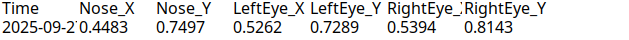

# Getting Started with Interactive agent React App

This project was bootstrapped with [Create React App](https://github.com/facebook/create-react-app).

## Configure Git

Assuming that you downloaded Git, start with config. In the terminal :

``
git config --global user.email "you@example.com"
``

``
git config --global user.name "Your Name"
``

then clone the project:
``
git clone https://github.com/Shahed-RAJOUB/interactive-agent.git
``

then start working by making a branch :
``
git checkout -b new-branch-name
``

do the changes and commit them with a message :
``
git commit -m 'message'
``
Push to the branch:
``
git push new-branch-name
``

Now you can login GitHub and create a Merge request with master and assign it to me for checking and merging.
once it is merged you have to start new with:

``
git checkout master
``
then 
``
git pull
``

and start over with new branch :) 

## Available Scripts

Install before 

### `npm install`

In the project directory, you can run:

### `npm start`

Runs the app in the development mode.\
Open [http://localhost:3000](http://localhost:3000) to view it in your browser.

The page will reload when you make changes.\
You may also see any lint errors in the console.

### `npm test`

Launches the test runner in the interactive watch mode.\
See the section about [running tests](https://facebook.github.io/create-react-app/docs/running-tests) for more information.

### `npm run build`

Builds the app for production to the `build` folder.\
It correctly bundles React in production mode and optimizes the build for the best performance.

The build is minified and the filenames include the hashes.\
Your app is ready to be deployed!

See the section about [deployment](https://facebook.github.io/create-react-app/docs/deployment) for more information.

### `npm run eject`

**Note: this is a one-way operation. Once you `eject`, you can't go back!**

If you aren't satisfied with the build tool and configuration choices, you can `eject` at any time. This command will remove the single build dependency from your project.

Instead, it will copy all the configuration files and the transitive dependencies (webpack, Babel, ESLint, etc) right into your project so you have full control over them. All of the commands except `eject` will still work, but they will point to the copied scripts so you can tweak them. At this point you're on your own.

You don't have to ever use `eject`. The curated feature set is suitable for small and middle deployments, and you shouldn't feel obligated to use this feature. However we understand that this tool wouldn't be useful if you couldn't customize it when you are ready for it.

## Learn More

You can learn more in the [Create React App documentation](https://facebook.github.io/create-react-app/docs/getting-started).

To learn React, check out the [React documentation](https://reactjs.org/).

### Code Splitting

This section has moved here: [https://facebook.github.io/create-react-app/docs/code-splitting](https://facebook.github.io/create-react-app/docs/code-splitting)

### Analyzing the Bundle Size

This section has moved here: [https://facebook.github.io/create-react-app/docs/analyzing-the-bundle-size](https://facebook.github.io/create-react-app/docs/analyzing-the-bundle-size)

### Making a Progressive Web App

This section has moved here: [https://facebook.github.io/create-react-app/docs/making-a-progressive-web-app](https://facebook.github.io/create-react-app/docs/making-a-progressive-web-app)

### Advanced Configuration

This section has moved here: [https://facebook.github.io/create-react-app/docs/advanced-configuration](https://facebook.github.io/create-react-app/docs/advanced-configuration)

### Deployment

This section has moved here: [https://facebook.github.io/create-react-app/docs/deployment](https://facebook.github.io/create-react-app/docs/deployment)

### `npm run build` fails to minify

This section has moved here: [https://facebook.github.io/create-react-app/docs/troubleshooting#npm-run-build-fails-to-minify](https://facebook.github.io/create-react-app/docs/troubleshooting#npm-run-build-fails-to-minify)

### Environment 

You will need env file ( just make a new file with the name .env and save the api key for weather in it )

``
REACT_APP_WEATHER_API_KEY=the key
``

In React, all env variables must start with REACT_APP_.

### Usage 

this project will show three buttons :
- Start ---> listen to you
- stop ----> stops listening
- reset ---> restart fresh

#### there are configured commands like when you say (Zeit) it shows time and when you say (Stopp Zeit) it stops it
#### Another command would be adding to ToDo list by saying (ToDo) when you are done (fertig)


#### Mediapipe data extraction for face movement recognition :

currently gathering data from Mediapipe Face Detection landmarks:

0 → nose tip

1 → left eye (inner corner)

2 → right eye (inner corner)

**then export it to excel :** 



| Column         | Example                    | Meaning                                                                                                |
| -------------- | -------------------------- | ------------------------------------------------------------------------------------------------------ |
| **Time**       | `2025-09-27T15:26:37.180Z` | Timestamp when this frame was recorded.                                                                |
| **Nose_X**     | `0.4483`                   | Horizontal position of the nose tip, normalized between 0 (left edge of the image) and 1 (right edge). |
| **Nose_Y**     | `0.7497`                   | Vertical position of the nose tip, normalized between 0 (top) and 1 (bottom).                          |
| **LeftEye_X**  | `0.5262`                   | Horizontal position of the left eye.                                                                   |
| **LeftEye_Y**  | `0.7289`                   | Vertical position of the left eye.                                                                     |
| **RightEye_X** | `0.5394`                   | Horizontal position of the right eye.                                                                  |
| **RightEye_Y** | `0.8143`                   | Vertical position of the right eye.                                                                    |

Key points:

Normalized coordinates:

* 0 = left/top of the video frame
* 1 = right/bottom of the video frame

Frame-based tracking:

Each row is one frame where a face was detected.

These can be used to track head movement over time.

Converting to pixels (optional):

```
If your canvas is 640x480 pixels:

pixelX = Nose_X * 640
pixelY = Nose_Y * 480

```

This gives the position on the actual video frame.